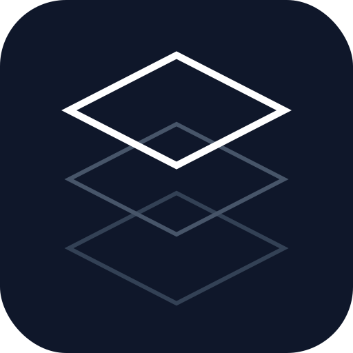

<p align="center">
  
</p>

<h1 align="center">Post-Cortex</h1>

<p align="center"><strong>Persistent Memory for AI Assistants</strong></p>

Post-Cortex is an MCP server that gives AI assistants long-term memory. It stores conversations, decisions, and insights in a searchable knowledge base with automatic entity extraction.

## Features

- **Persistent Memory** - Conversations survive across sessions
- **Semantic Search** - Find related content using AI embeddings
- **Knowledge Graph** - Automatic entity and relationship extraction
- **Privacy-First** - All processing runs locally, no external APIs
- **Fast** - Lock-free Rust architecture, <10ms queries

## Installation

```bash
# Homebrew (macOS/Linux)
brew install julymetodiev/tap/post-cortex

# Or download binary
curl -L https://github.com/julymetodiev/post-cortex/releases/latest/download/pcx-aarch64-apple-darwin -o /usr/local/bin/pcx
chmod +x /usr/local/bin/pcx
```

## Quick Start

### 1. Configure Claude Desktop

Add to `~/Library/Application Support/Claude/claude_desktop_config.json`:

```json
{
  "mcpServers": {
    "post-cortex": {
      "command": "pcx"
    }
  }
}
```

### 2. Create a Session

Ask Claude: *"Create a Post-Cortex session for this project"*

### 3. Use Memory

Claude will automatically store important context and search past knowledge.

## MCP Tools (6 Tools)

### `session` - Manage Sessions

```
session(action: "create", name: "my-project", description: "Project notes")
session(action: "list")
```

### `update_conversation_context` - Store Knowledge

```
// Single update
update_conversation_context(
  session_id: "uuid",
  interaction_type: "decision_made",
  content: {
    "decision": "Use PostgreSQL",
    "rationale": "Better JSON support"
  }
)

// Bulk update
update_conversation_context(
  session_id: "uuid",
  updates: [
    {interaction_type: "qa", content: {...}},
    {interaction_type: "code_change", content: {...}}
  ]
)
```

**Interaction types:** `qa`, `decision_made`, `problem_solved`, `code_change`

### `semantic_search` - Find Related Content

```
// Search within session
semantic_search(query: "database decisions", scope: "session", scope_id: "uuid")

// Search across workspace
semantic_search(query: "authentication", scope: "workspace", scope_id: "ws-uuid")

// Search everything
semantic_search(query: "performance issues", scope: "global")
```

### `get_structured_summary` - Session Overview

```
// Get decisions only
get_structured_summary(session_id: "uuid", include: ["decisions"])

// Get insights only
get_structured_summary(session_id: "uuid", include: ["insights"])

// Get full summary
get_structured_summary(session_id: "uuid", include: ["all"])
```

### `query_conversation_context` - Query Entities

```
// Entity importance ranking
query_conversation_context(
  session_id: "uuid",
  query_type: "entity_importance",
  parameters: {"limit": "10"}
)

// Keyword search
query_conversation_context(
  session_id: "uuid",
  query_type: "search_updates",
  parameters: {"keyword": "API"}
)
```

### `manage_workspace` - Organize Sessions

```
manage_workspace(action: "create", name: "trading-project")
manage_workspace(action: "list")
manage_workspace(action: "add_session", workspace_id: "ws-uuid", session_id: "uuid", role: "primary")
manage_workspace(action: "remove_session", workspace_id: "ws-uuid", session_id: "uuid")
```

**Roles:** `primary`, `related`, `dependency`, `shared`

## Daemon Mode

For multiple Claude instances sharing the same memory:

```bash
# Start daemon
pcx start

# Check status
pcx status

# Stop daemon
pcx stop
```

Configure Claude for SSE:
```json
{
  "mcpServers": {
    "post-cortex": {
      "type": "sse",
      "url": "http://localhost:3737/sse"
    }
  }
}
```

## Data Export/Import

Backup and restore your memory database:

```bash
# Full export
pcx export --output backup.json

# Export with compression
pcx export --output backup.json.gz

# Export specific session
pcx export --output session.json --session <uuid>

# List contents of backup
pcx import --input backup.json --list

# Import (skip existing)
pcx import --input backup.json --skip-existing

# Import (overwrite existing)
pcx import --input backup.json --overwrite
```

**Compression:** Auto-detected from extension (`.json`, `.json.gz`, `.json.zst`)

## Environment Variables

| Variable | Default | Description |
|----------|---------|-------------|
| `PC_HOST` | 127.0.0.1 | Bind address |
| `PC_PORT` | 3737 | Port |
| `PC_DATA_DIR` | ~/.post-cortex/data | Storage location |

## Performance

| Operation | Latency |
|-----------|---------|
| Semantic search | 1-7ms |
| Keyword search | <10ms |
| Context update | <5ms |

## Development

```bash
# Build
cargo build --release --features embeddings

# Test
cargo test

# Run with logging
RUST_LOG=debug pcx start
```

## License

MIT
